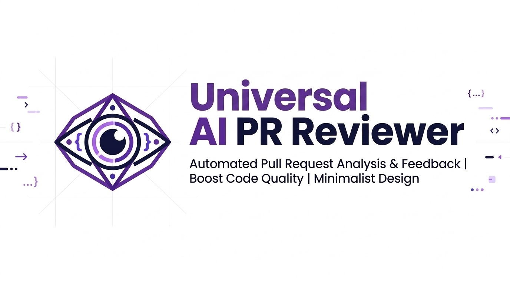

# AI PR Reviewer

<p align="center">
  
</p>

<p align="center">
  <a href="https://github.com/edsoncarlosdevops/ai-pr-reviewer/releases"></a>
  <a href="https://github.com/marketplace/actions/ai-pr-reviewer"></a>
  <a href="https://opensource.org/licenses/MIT"></a>
  <a href="https://github.com/edsoncarlosdevops/ai-pr-reviewer/stargazers"></a>
</p>

---

## 📌 Overview & Value Proposition

**AI PR Reviewer** is an enterprise-grade, multi-platform, AI-driven code review engine designed to automate pull request reviews across GitHub Actions, Azure DevOps, and GitLab CI.

Unlike simple diff summarizers or closed SaaS subscriptions, **AI PR Reviewer** provides an **agnostic, local-first CLI engine** with **pluggable LLM providers** (DeepSeek, OpenAI, Anthropic Claude, or local OpenAI-compatible models). It evaluates git patches against repository-specific guidelines (`AGENTS.md`), architecture specifications, and specialized domain rules (Terraform, ROS 2, Docker, Kubernetes, Python, CI/CD).

### Why AI PR Reviewer over PR-Agent, Qodo, or SaaS Alternatives?

| Feature | AI PR Reviewer | Traditional SaaS Tools | Basic GitHub Actions |
| :--- | :---: | :---: | :---: |
| **Agnostic Core CLI** | ✅ Runs locally, in Docker, or on any CI/CD runner | ❌ Vendor lock-in | ❌ GitHub Actions only |
| **Bring Your Own Model (BYOM)** | ✅ DeepSeek Pro, OpenAI, Anthropic, or local LLMs | ❌ Fixed model selection | ❌ Hardcoded models |
| **Multi-Language Feedback** | ✅ Multilingual output support (EN, PT, ES, FR, DE) | 🟡 English only | ❌ English only |
| **Context Aware (`AGENTS.md`)** | ✅ Ingests internal governance & repository guides | ❌ Requires workspace indexing | ❌ Diff only |
| **Clean Output Formatting** | ✅ Clean Markdown tables, standardized score & emoji severities | 🟡 Varied formatting | ❌ Generic text |
| **Zero Data Leakage** | ✅ Direct API calls to your chosen LLM endpoint | ❌ Third-party SaaS storage | 🟡 Direct API |

---

## 🌟 Key Features

- **Multi-Cloud & Infrastructure Native**: Built-in rules for **Terraform/OpenTofu**, **ROS 2 robotics telemetry**, **Docker multi-stage**, **Kubernetes manifests**, and **GitHub Actions workflows**.
- **Pluggable Model Architecture**: Use **DeepSeek V4-Pro** (~$0.003/review), **GPT-4o / GPT-4o-mini**, **Claude 3.5 Sonnet**, or any OpenAI-compatible custom API endpoint.
- **Multilingual Feedback Support**: Configurable feedback output language (English, Portuguese, Spanish, French, German) via `.pr_reviewer.toml`.
- **Agnostic Core Architecture**: The core Python engine is decoupled from CI/CD runners. Execute via GitHub Actions, Azure DevOps Pipelines, GitLab CI, or terminal CLI.
- **Operational Risk Assessment**: Identifies missing files, breaking cross-repository dependencies, and unhandled runtime exceptions before merging.
- **Optional Jira Requirements Validation**: Matches PR titles/branches to Jira issues and verifies Acceptance Criteria completion.

---

## 🔑 API Keys & Authentication Setup

`AI PR Reviewer` supports any LLM provider (DeepSeek, OpenAI, Anthropic). Supply your provider API key via standard secrets or environment variables depending on your platform:

| Provider | Environment Variable / Input Parameter | How to Obtain API Key |
| :--- | :--- | :--- |
| **DeepSeek (Default)** | `DEEPSEEK_API_KEY` | [platform.deepseek.com](https://platform.deepseek.com) |
| **OpenAI** | `OPENAI_API_KEY` | [platform.openai.com](https://platform.openai.com) |
| **Anthropic** | `ANTHROPIC_API_KEY` | [console.anthropic.com](https://console.anthropic.com) |

### 🔐 Platform Secret Configuration

- **GitHub Actions**: Go to **Settings -> Secrets and variables -> Actions**, click **New repository secret**, and create `DEEPSEEK_API_KEY` (or `OPENAI_API_KEY`).
- **Azure DevOps**: Store `DEEPSEEK_API_KEY` inside a **Variable Group** (e.g. `global-secrets`) or pipeline variable with secret encryption enabled.
- **GitLab CI**: Go to **Settings -> CI/CD -> Variables**, add `DEEPSEEK_API_KEY`, and mark it as **Masked** and **Protected**.
- **Local CLI**: Export via shell environment variable: `export DEEPSEEK_API_KEY="sk-..."` or `export OPENAI_API_KEY="sk-..."`.

---

## 🔍 How "Context Consulted" Scans Your Repository

The `Context consulted` section in the generated review automatically discovers, ingests, and enforces governance files across your codebase:

1. **Recursive `AGENTS.md` Ingestion**: Scans the root and all subdirectories for `AGENTS.md` files (e.g., `root/AGENTS.md`, `terraform/AGENTS.md`, `azure/AGENTS.md`).
2. **Repository Guide**: Ingests `README.md` to align reviews with project architecture.
3. **Extra Custom Files**: Add any architectural document (e.g. `docs/architecture.md`, `CONTRIBUTING.md`) in `.pr_reviewer.toml` under `extra_context_files`.
4. **Automatic Language/Tech Rules**: Detects modified file extensions and automatically injects domain rules (`prompts/terraform.md`, `prompts/ros2.md`, `prompts/docker.md`, `prompts/kubernetes.md`, `prompts/python.md`, `prompts/github_actions.md`).

---

## 🚀 Quickstart & Integration Guides

### 1. GitHub Actions

Add `.github/workflows/ai-review.yml` to your repository:

```yaml
name: AI PR Review
on:
  pull_request:
    types: [opened, synchronize, reopened]

jobs:
  review:
    runs-on: ubuntu-latest
    permissions:
      contents: read
      pull-requests: write
    steps:
      - uses: actions/checkout@v4
        with:
          fetch-depth: 0

      - uses: edsoncarlosdevops/ai-pr-reviewer@v1
        with:
          github_token: ${{ secrets.GITHUB_TOKEN }}
          deepseek_api_key: ${{ secrets.DEEPSEEK_API_KEY }}
```

### 2. Azure DevOps Pipelines

Include the reusable pipeline template in `azure-pipelines.yml`:

```yaml
trigger: none
pr:
  branches:
    include:
      - main

resources:
  repositories:
  - repository: ai-reviewer
    type: github
    name: edsoncarlosdevops/ai-pr-reviewer
    ref: refs/tags/v1
    endpoint: github-service-connection

stages:
- template: wrappers/azure-devops/ai-pr-review-template.yml@ai-reviewer
  parameters:
    model_name: deepseek-chat
    deepseek_api_key: $(DEEPSEEK_API_KEY)
```

### 3. GitLab CI

Add the include block to `.gitlab-ci.yml`:

```yaml
include:
  - remote: 'https://raw.githubusercontent.com/edsoncarlosdevops/ai-pr-reviewer/v1/wrappers/gitlab-ci/.ai-review.yml'

variables:
  DEEPSEEK_API_KEY: $DEEPSEEK_API_KEY
  AI_REVIEW_MODEL: "deepseek-chat"
```

### 4. Local CLI / Terminal Execution

```bash
# Clone and install dependencies
git clone https://github.com/edsoncarlosdevops/ai-pr-reviewer.git
cd ai-pr-reviewer
pip install -r requirements.txt

# Export your API Key
export DEEPSEEK_API_KEY="your-deepseek-api-key"

# Generate local git patch and run review
git diff origin/main...HEAD > /tmp/pr.patch
python core/cli.py --diff /tmp/pr.patch --workspace . --output review.md

# View generated review
cat review.md
```


---

## ⚙️ Configuration (`.pr_reviewer.toml`)

Create a `.pr_reviewer.toml` file in the root of your target repository to customize reviewer persona, model provider, and feedback language:

```toml
[reviewer]
name = "AI PR Reviewer"
model = "deepseek-chat"
provider = "deepseek"
severity_threshold = "low"
language = "portuguese"

[context]
extra_context_files = [
  "docs/architecture.md",
  "CONTRIBUTING.md"
]

[jira]
enabled = false
base_url = "https://your-org.atlassian.net"
```

---

## 📊 Sample Output Preview

# PR Review

### Review scope

| Check | Result |
|-------|--------|
| git fetch + diff | `origin/master..HEAD` — 1 commit(s) — author |
| Files touched | `ros2_nodes/drone_telemetry/telemetry/subscriber.py` (+11 / -4) |
| Directories touched | `ros2_nodes/drone_telemetry/telemetry/` |
| DDL / Schema changes | None |
| Runtime / FE / UX code | Runtime ROS 2 telemetry subscriber code |

### Jira Context
No Jira ticket linked or Jira integration disabled.

### Context consulted
- `README.md`
- `prompts/ros2.md`

### Findings
O PR modifica a função `odom_callback` no arquivo `subscriber.py` para calcular a taxa de mensagens. A implementação atual introduz riscos de exceção em tempo de execução e vazamento de descritores de arquivo em loops de alta frequência.

### Issues

🔴 **Critical** — `[subscriber.py:125]` — Risco de `ZeroDivisionError` ao calcular `rate = 1.0 / dt`. Em tópicos ROS 2 de alta frequência (ex: 100Hz), mensagens consecutivas podem registrar o mesmo timestamp em nanossegundos (`dt = 0`). Adicione validação `if dt > 0:`.

🟠 **High** — `[subscriber.py:130]` — Vazamento de descritores de arquivo. Abrir `/tmp/subscriber_debug.log` diretamente na callback a cada mensagem sem fechar o ponteiro causará esgotamento de descritores de arquivo (`EMFILE`). Utilize o logger do ROS 2 (`self.get_logger()`).

### Overall

**Quality Score:** `4.5 / 10` — Exceção não tratada e vazamento de descritores de arquivo.

**Merge Recommendation:** `Request changes` — Corrigir o risco de divisão por zero e vazamento de arquivos antes de realizar o merge.

**Evaluator:** `deepseek-chat`

---

## 🏷️ Keywords & Search Optimization (SEO)

`ai code review` `github action code review` `deepseek code review` `automated pull request review` `pr agent alternative` `qodo merge alternative` `terraform ai code review` `ros2 ai review` `azure devops ai pr review` `gitlab ci ai review` `iac security scanner` `llm code auditor`

---

## 🤝 Contributing & Star History

Contributions are welcome! Please feel free to submit a Pull Request or open an Issue.

If you find **AI PR Reviewer** helpful, give us a ⭐ on GitHub to support the project!

---

## ⚖️ License

MIT License. Copyright (c) 2026 Edson Carlos. See [LICENSE](LICENSE) for details.
